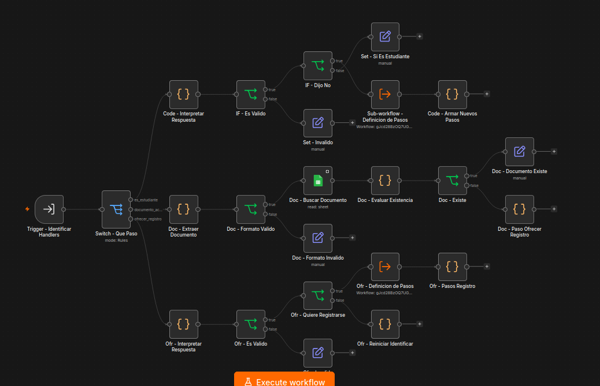
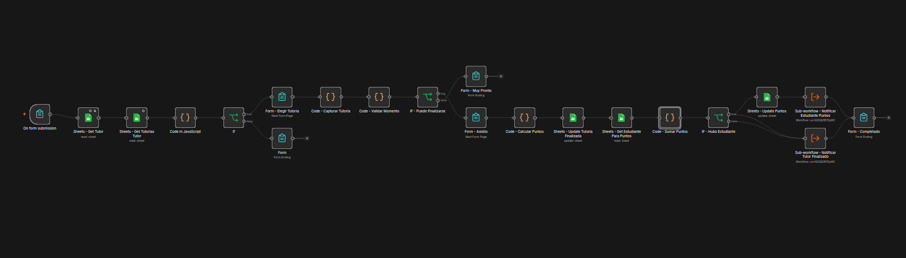
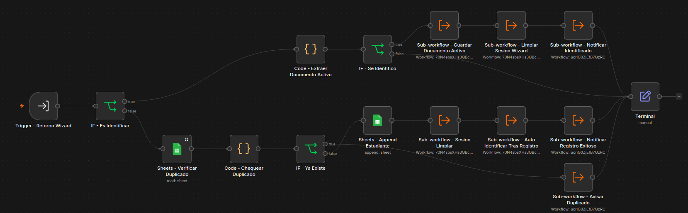
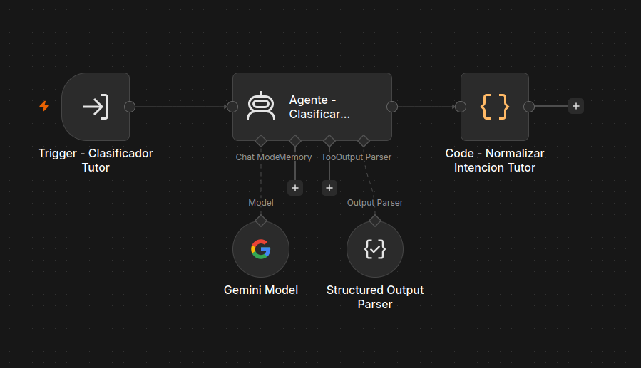
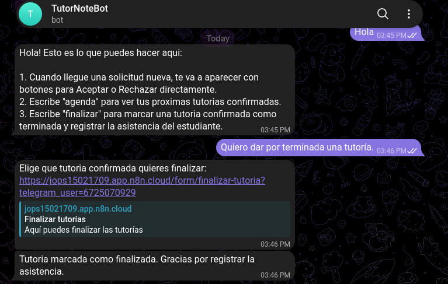
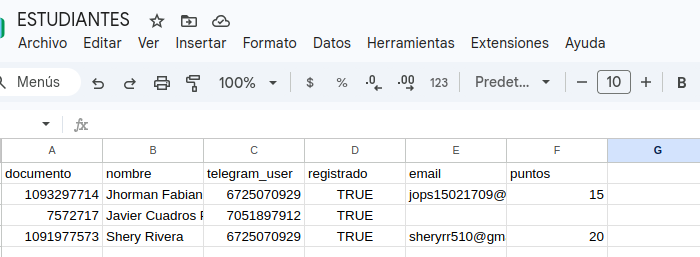

# TutorBot — Sistema de Asesorías Académicas

Proyecto Final 2778 · Automatización de tutorías con Telegram + n8n + Google Sheets + IA.

## 1. El problema

**Formulación:** Actualmente el estudiante necesita encontrar un tutor disponible para su materia, pero enfrenta un proceso disperso entre correos, mensajes informales y falta de visibilidad sobre la disponibilidad real de los tutores. Esto provoca cruces de horario, solicitudes sin atender y ausencia de trazabilidad. TutorBot debería ayudar a automatizar la solicitud, asignación y seguimiento de una asesoría, sin depender de coordinación manual en cada paso, y sin permitir que dos personas reserven el mismo recurso al mismo tiempo.

## 2. Actores

| Actor | Necesidad | Cómo se resuelve en TutorBot |
|---|---|---|
| Estudiante | Identificarse una vez, solicitar, consultar y cancelar tutorías, y ver sus puntos de constancia | Bot de Telegram con Agente de IA + wizard de identificación/registro + formularios web |
| Tutor | Recibir solicitudes, gestionar su agenda y finalizar sus tutorías | Bot de Telegram con Agente de IA: botones Aceptar/Rechazar, "agenda", "finalizar" |
| Coordinación académica | Visibilidad y trazabilidad de la actividad | Reporte semanal por correo (HTML) + alertas de tutores con muchos timeouts |
| Sistema TutorBot | Mantener reglas y datos consistentes | 21 workflows en n8n, cada uno con una responsabilidad única |

## 3. Arquitectura general — 21 workflows

**Principio seguido:** un workflow = una responsabilidad de negocio (evitando el "workflow gigante" que la guía advierte explícitamente que hay que evitar). La comunicación entre workflows usa **Execute Sub-workflow** en todos los casos con un llamador fijo conocido de antemano (no cuenta como ejecución extra); se mantiene **Webhook/Sub-workflow con ID dinámico** solo donde el destino se decide en tiempo de ejecución (ver sección 8).

> Nota de numeración: los workflows `20` y `21` originales (validación de documento e "ofrecer registro" del login) se consolidaron en el `19` para simplificar el proyecto. El número `20` se reutilizó para "Finalizar Tutoría"; el `21` quedó libre a propósito.

| # | Workflow | Responsabilidad |
|---|---|---|
| **Núcleo** | | |
| 01 | Núcleo - Administrador de Sesiones | Lee/guarda/limpia el estado del wizard **y** el `documento_activo` (identidad persistente) de cada usuario |
| 02 | Núcleo - Definición de Pasos | Leer la hoja STEPS y agruparla |
| 03 | Núcleo - Calcular Disponibilidad | Motor de asignación: materia + tutor activo + disponibilidad + sin cruce de horario (incluye `Finalizada` como ocupado) |
| 04 | Núcleo - Notificaciones | Único punto de envío por Telegram (estudiante/tutor) y Gmail (HTML) |
| 05 | Núcleo - Procesador de Pasos | Motor del wizard: valida cada respuesta según `type`, despacha `logic`/`direccion_retorno` por Sub-workflow con ID dinámico |
| **Estudiante** | | |
| 06 | Estudiante - Router (entrada) | Entrada real de Telegram; decide por `documento_activo` (no por "registrado") si va al Clasificador o a identificarse |
| 07 | Estudiante - Clasificador de Intención (IA) | Agente de IA (Gemini 3.1 Flash Lite) clasifica el mensaje libre y dirige |
| 08 | Estudiante - Iniciar Wizard | Arranca cualquier wizard (`registro` o `identificar`) según parámetro |
| 09 | Estudiante - Registro (formulario datos) | Nombre y correo, por formulario web (el documento ya viene validado del chat) |
| 10 | Estudiante - Validar Documento | Formato (6-15 dígitos) + rechaza duplicados guiando a identificarse |
| 11 | Estudiante - Solicitar Tutoría (formulario) | Formulario de 3 páginas en cascada: Materia+Fecha → Tutor → Hora; guarda el `documento` del solicitante |
| 12 | Estudiante - Cancelar Tutoría (formulario) | Formulario con dropdown de tutorías activas del estudiante |
| 13 | Estudiante - Consultar Tutorías | "Mis tutorías" por chat |
| 19 | Estudiante - Identificar (Handlers) | 3 ramas (¿eres estudiante? / validar documento / ofrecer registro) consolidadas en un solo workflow con Switch interno |
| 22 | Estudiante - Retorno de Wizards | Punto de retorno único de `registro` e `identificar`: guarda `documento_activo`, evita duplicados, limpia sesión |
| **Tutor** | | |
| 14 | Tutor - Router (entrada) | Entrada real de Telegram; usa el Agente de IA (`23`) para texto libre, botones para callbacks |
| 15 | Tutor - Aceptar o Rechazar | Procesa el botón de una solicitud |
| 16 | Tutor - Agenda | "Agenda" por chat |
| 20 | Tutor - Finalizar Tutoría (formulario) | Marca una tutoría `Confirmada` como `Finalizada`, registra asistencia y reparte puntos |
| 23 | Tutor - Clasificador de Intención (IA) | Agente de IA (Gemini) para el bot del tutor: reconoce sinónimos de "agenda" y "finalizar" |
| **Automatización programada** | | |
| 17 | Cron - Timeouts y Monitoreo | Cierra solicitudes vencidas (>2h sin respuesta) + alerta si un tutor acumula 3+ timeouts *(inactivo hasta la demo)* |
| 18 | Cron - Reporte Semanal | Correo HTML a coordinación cada lunes con materia y tutor top |

```
        ESTUDIANTE (Telegram)                        TUTOR (Telegram)
               │                                            │
    06 Router de Estudiante                        14 Router del Tutor
   (tiene documento_activo?)                    (IA: agenda/finalizar/ayuda)
        │             │                              │            │
        ▼             ▼                              ▼            ▼
  19 Identificar   07 Clasificador (IA)          15 Aceptar/   16 Agenda
  (si no tiene         │                          Rechazar        │
   documento)   ┌──────┼───────┬─────────┬────────────┐           ▼
        │       ▼      ▼       ▼         ▼            ▼      20 Finalizar
        ▼   11 Sol.  13     12 Cancelar 07 Puntos  (info/     Tutoria
  08 Wizard  Tutoria Consultar Tutoria  /sesión     ayuda)   (+puntos)
   → 22 Retorno         │
   (guarda            10 Validar
   documento_activo)   Documento

  Todos pasan por: 01 Sesion, 05 Procesador de Pasos (solo wizard),
  02 Definicion de Pasos (solo wizard), 04 Notificaciones (todos)
  17 y 18 corren solos, programados.
```

## 4. Modelo de datos — punto de partida vs. lo implementado

Las 7 hojas de `TutorBot_DB`: ESTUDIANTES, TUTORES, TUTOR_MATERIA, DISPONIBILIDAD, TUTORIAS, SESSION, STEPS. Ver `docs/analisis.md` para la justificación completa frente al modelo de 4 hojas del enunciado.

**Columnas agregadas durante el proyecto** (más allá del modelo inicial):
- `SESSION.documento_activo` — identidad persistente del estudiante en la conversación, independiente del wizard.
- `ESTUDIANTES.email`, `ESTUDIANTES.puntos` — correo de contacto y puntos de constancia académica.
- `TUTORIAS.documento`, `TUTORIAS.asistio` — qué estudiante exacto solicitó la tutoría (no solo el chat de Telegram, que puede tener varios estudiantes) y si asistió.

## 5. Flujo conversacional como máquina de estados (FSM)

Dos flujos usan el motor de wizard genérico (Sesión + STEPS + Procesador de Pasos), ambos data-driven, sin un IF por pregunta:

- **`registro`**: documento (validado y verificado que no exista) → nombre + correo (formulario).
- **`identificar`**: corre siempre que no hay `documento_activo` en la sesión. ¿Eres estudiante? → documento (si existe, identifica; si no, ofrece registro) → deja al estudiante "logueado" hasta que escribe "cerrar sesión".

Solicitar y Cancelar Tutoría usan formularios web de varias páginas en vez del wizard de chat, porque su naturaleza es distinta — "elegir de una lista que depende de la anterior", no "responder una pregunta a la vez". Esto es una decisión consciente: se usó la herramienta correcta para cada problema, no la misma para todo.

**Persistencia:** el estado del wizard vive en la hoja SESSION (`flujo_actual`, `pasos_restantes`, `datos_parciales`, `direccion_retorno`), leído/escrito en cada turno porque cada mensaje de Telegram es una ejecución de n8n independiente — no hay memoria de proceso entre una y otra. `documento_activo` vive en esa misma hoja pero es un mecanismo aparte: sobrevive a los `limpiar` normales del wizard, y solo se borra con "cerrar sesión".

## 6. Ciclo de vida de la tutoría

```
Solicitada → Asignada → Confirmada → Finalizada
                 │            │
                 │            └── (20, tutor: ≥1h tras el inicio) ──► Finalizada + puntos
                 ├── timeout (17) ──┐
                 └── rechazo (15) ──┴──► Cancelada (con motivo_cierre)
```

`motivo_cierre`: `rechazo_tutor | timeout_tutor | cancelacion_estudiante`.
`asistio`: `Si | No` (solo se llena al finalizar). Puntos: **+10** si asistió, **-5** si no.

## 7. Motor de asignación (reglas de negocio)

Dado `materia` + `fecha`, un horario es válido si: (1) existe tutor para esa materia en TUTOR_MATERIA, (2) ese tutor está `Activo`, (3) tiene disponibilidad habitual ese día de la semana, (4) el bloque no coincide con una tutoría ya existente en estado `Solicitada`, `Asignada`, `Confirmada` **o `Finalizada`** para ese tutor. (5) La fecha solicitada no puede ser anterior a hoy.

Para finalizar una tutoría (`20`), además: no puede ser antes de la hora de inicio, y debe haber pasado al menos 1 hora desde que comenzó.

## 8. Decisiones de arquitectura

- **Webhook/Sub-workflow con ID dinámico solo donde el destino se decide en tiempo de ejecución:** los handlers `logic` de STEPS (guardan un **ID de workflow**, no una URL, en la columna `handler`) y `direccion_retorno`. El único formulario que sigue usando una URL real es `pedir_datos` del registro, porque ahí el destino es un navegador, no otro workflow.
- **IA solo para clasificar intención** (estudiante en `07`, tutor en `23`; ambos Gemini 3.1 Flash Lite + salida estructurada), nunca para decidir asignación, horario, puntos o estado — la asignación, validación de fecha/documento y reglas de negocio son 100% determinísticas (Code nodes y condiciones), justo la separación que pide la guía en su sección 12.
- **Identidad persistente vs. wizard temporal:** `documento_activo` en SESSION sobrevive a los `limpiar` normales (solo se borra con "cerrar sesión"); el resto del wizard (`flujo_actual`, `pasos_restantes`, `datos_parciales`) se limpia al terminar cada flujo. Son dos mecanismos separados a propósito.

## 9. Cómo importar y probar

1. Crear el Google Sheet `TutorBot_DB` con las 7 hojas de la sección 4 (incluyendo las columnas nuevas).
2. Importar los `.json` de `workflows/` a una instancia de n8n.
3. Configurar credenciales: Google Sheets, Telegram (2 bots), Gmail, y un modelo de IA (Google Gemini).
4. Activar todos los workflows salvo `17 - Cron - Timeouts y Monitoreo` (dejar inactivo hasta la demo final).
5. Completar la hoja STEPS con los flujos `registro` e `identificar` (ver `docs/analisis.md`).

## 10. Limitaciones conocidas y qué cambiaría en producción

- **Concurrencia / race conditions:** no resuelto, solo documentado — ver `docs/analisis.md`.
- **Menú de materias estático:** el formulario de Solicitar Tutoría (11) tiene el dropdown de materias fijo en el diseño del nodo, no leído dinámicamente de TUTOR_MATERIA (la primera página de un formulario no puede depender de datos previos en la misma ejecución). Agregar una materia nueva requiere editar ese nodo a mano.
- **Timezone:** fechas/horas como texto simple, sin zona horaria explícita.
- **Varios estudiantes por chat de Telegram:** si dos estudiantes comparten un chat, "Solicitar" y "Finalizar" quedan resueltos por `documento` exacto; el link de Cancelar Tutoría todavía no usa ese dato internamente (sigue filtrando por chat).
- **Credenciales de Telegram:** viven en la configuración de los nodos HTTP dentro de n8n (no en el repositorio ni en las hojas), pero en texto plano dentro de la URL del nodo — en producción se recomendaría moverlas a una credencial de n8n dedicada en vez de la URL.

## 11. Uso de IA

| Decisión | ¿Quién decide? |
|---|---|
| Clasificar la intención de un mensaje libre (estudiante y tutor) | IA (Gemini 3.1 Flash Lite + salida estructurada) |
| Validar fecha, documento, disponibilidad, asignar tutor/horario, calcular puntos | Reglas determinísticas |
| Redacción de mensajes al usuario | Texto fijo, no generado por IA |

## 12. Capturas

### 12.1 Workflows

#### 01 · Administrador de Sesiones


#### 02 · Definición de Pasos


#### 03 · Calcular Disponibilidad


#### 04 · Notificaciones


#### 05 · Procesador de Pasos


#### 06 · Router de Estudiante


#### 07 · Clasificador de Intención (IA)


#### 08 · Iniciar Wizard


#### 09 · Registro (formulario datos)


#### 10 · Validar Documento


#### 11 · Solicitar Tutoría (formulario)


#### 12 · Cancelar Tutoría (formulario)


#### 13 · Consultar Tutorías


#### 14 · Router del Tutor


#### 15 · Aceptar o Rechazar


#### 16 · Agenda del Tutor


#### 17 · Timeouts y Monitoreo


#### 18 · Reporte Semanal


#### 19 · Identificar (Handlers)


#### 20 · Finalizar tutoría


#### 21 · Retorno de Wizards


#### 22 · Clasificador del Tutor (IA)



### 12.2 Conversaciones

#### Registro


#### Solicitar tutoría


#### Tutor


#### Finalizar tutoría




#### Consultar y cancelar


#### Casos de error y reportes


## 13. Estructura del repositorio

```
TutorBot/
├── README.md
├── workflows/          (los .json de n8n, listos para importar)
├── docs/
│   ├── analisis.md
│   └── pruebas.md
└── capturas/
    ├── workflows/        (capturas de canvas)
    ├── chat/             (capturas de conversaciones)
```

## 14. Update: Examen — Sistema de Puntos por Asistencia

**Lógica implementada:** cuando el tutor marca una tutoría `Confirmada` como finalizada (formulario nuevo, `20`), el sistema pregunta si el estudiante asistió y calcula puntos con una expresión matemática simple: **+10 si asistió, -5 si no**. Busca al estudiante exacto en ESTUDIANTES (por `documento`, no por el chat de Telegram, que puede tener varios estudiantes) y **suma** ese delta a su balance actual (`puntos_previos + delta`). El estudiante recibe la notificación con el balance actualizado, con el formato exacto pedido. Se agregó además la opción "Ver mis Puntos" al menú del bot, y una validación de horario: no se puede finalizar antes de que la tutoría empiece, ni antes de que pase 1 hora desde su inicio.

**1 workflow nuevo:**
- `20 - Tutor - Finalizar Tutoría (formulario)` — filtra las tutorías `Confirmada` del tutor, valida el horario, pregunta asistencia, calcula y persiste los puntos, notifica a ambos.

**Workflows existentes que hubo que ajustar para que el cálculo fuera correcto:**
- `03 - Calcular Disponibilidad`: una tutoría `Finalizada` no contaba como horario ocupado — el tutor quedaba disponible otra vez para esa misma hora.
- `11 - Solicitar Tutoría`: el `documento` del estudiante llegaba en la URL del formulario pero nunca se guardaba en TUTORIAS — sin esto, `20` no podía saber a **cuál** estudiante sumarle los puntos si el chat tenía más de uno registrado.
- `07 - Clasificador de Intención`: nueva intención `consultar_puntos` + opción en el menú de ayuda.
- `14 - Router del Tutor`: reconoce la palabra "finalizar" y manda el link al formulario nuevo.

**Columnas nuevas en las hojas:** `ESTUDIANTES.puntos`, `TUTORIAS.asistio`, `TUTORIAS.documento`.
